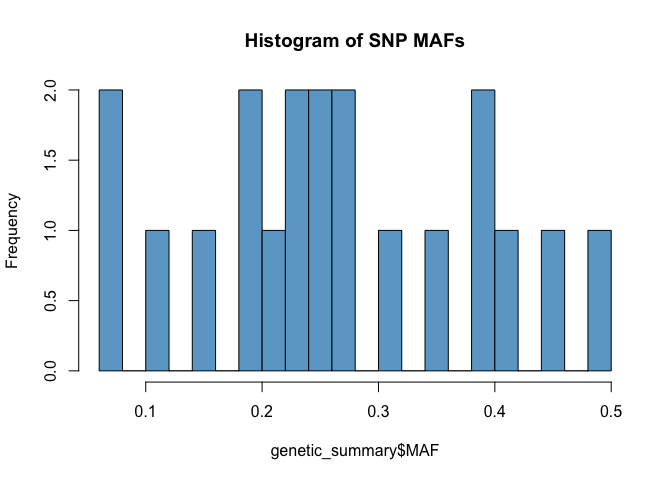
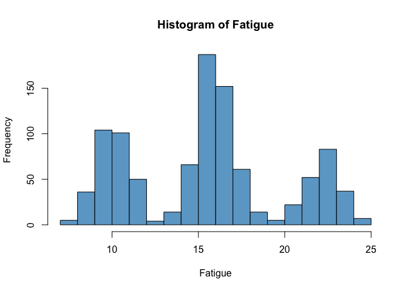
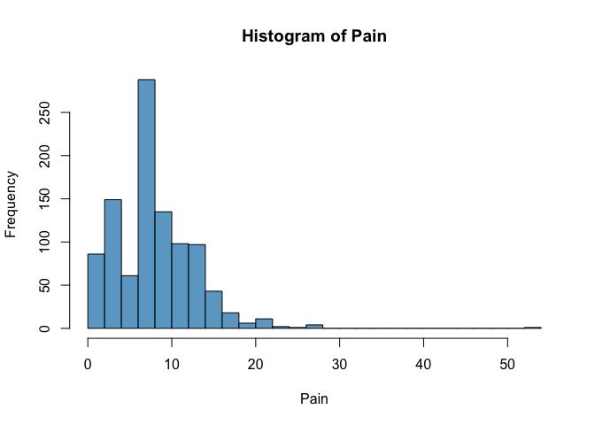
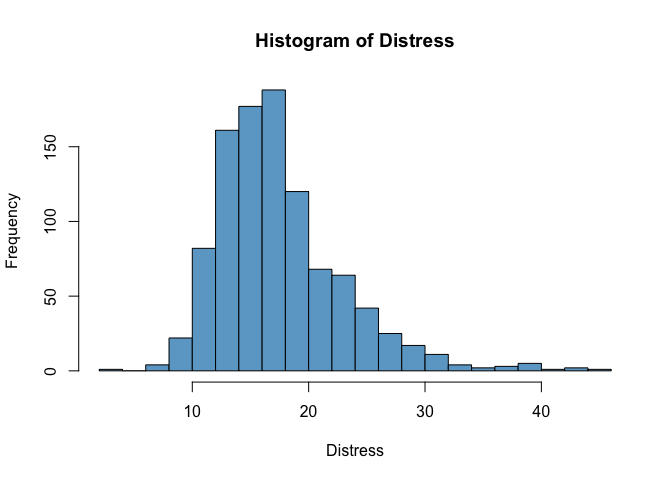
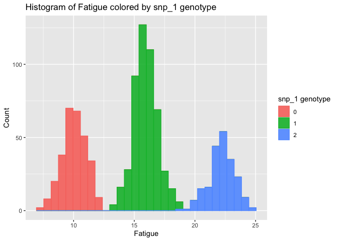
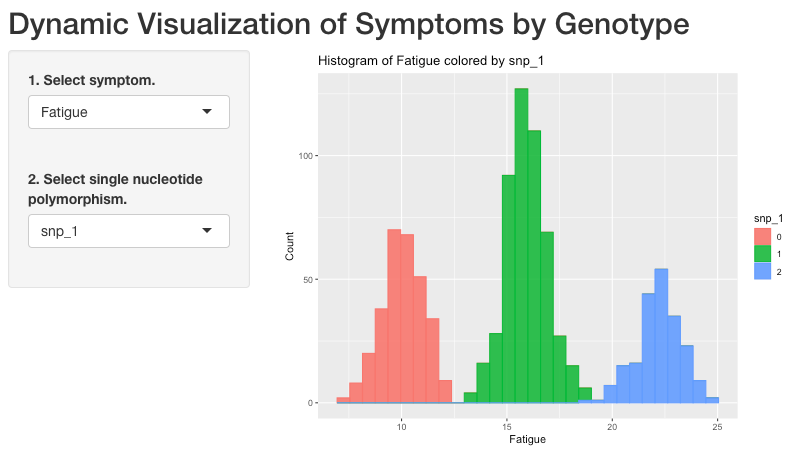
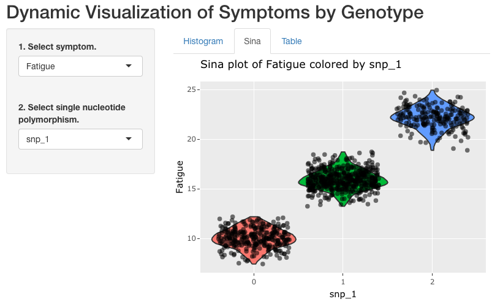
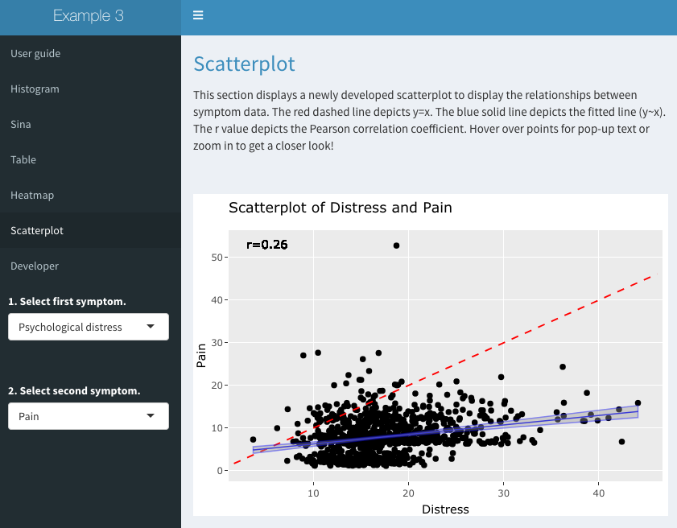

Advancing Nursing Research through Interactive Data Visualization with R
Shiny
================
Lacey W. Heinsberg

# Copyright

Copyright 2022, University of Pittsburgh. All Rights Reserved.  
License:
[GPL-2](https://www.gnu.org/licenses/old-licenses/gpl-2.0.en.html)

Note, you may use, modify, and/or redistribute this code under the terms
of the GNU General Public License (GPLv2). The GNU General Public
License does not permit this software to be redistributed in proprietary
programs.

# About

This repository contains R markdown code for use with “Advancing Nursing
Research through Interactive Data Visualization with R Shiny” \[LINK TO
PAPER TO BE ADDED WHEN AVAILABLE\].

The purpose of the paper was to highlight the benefits of R for
scientific data visualization, with a specific focus on creating
dynamic, interactive figures using the R shiny package. The purpose of
this repository is to provide annotated example code as a tutorial for
building shiny applications in R. This markdown contains code to build
three example shiny applications of increasing complexity.

# Dependencies

The code relies on R package dependencies listed within the “Load
libraries” section of `NurShiny_Tutorial.Rmd`. These libraries have also
been listed in this README file below.

# Execution

R Studio can be used to execute the .Rmd code using the `Run Document`
function from the quick bar.

We have also included details of the code with static images of the
shiny application examples in this README file to support online
viewing. Please note, however, that to recreate the examples from the
paper with full, interactive functionality, you will need to access and
use `NurShiny_Tutorial.Rmd` available in this repository.

# Load libraries

``` r
library(tidyverse) # Tidy data
library(echoseq) # Simulation of genetic data
# Install using remotes::install_github("hruffieux/echoseq")
library(pander) # Tables
library(ggplot2) # Figures
library(reshape2) # Reshape data for heatmap
library(ggpubr) # Correlation statistics
library(shiny) # Shiny application 
library(shinydashboard) # Shiny application 
library(shinyWidgets) # Shiny application 
library(shinycssloaders) # Spinner for shiny plots
library(plotly) # Plotly output
library(grateful) # References
# Install using remotes::install_github("Pakillo/grateful")
```

# Scenario

Suppose you and your research group are conducting a study to examine
genetic variation of the symptom experience in individuals with
diabetes. The purpose of your study is to determine the association
between a panel of (fictitious) single nucleotide polymorphisms (SNPs)
and three quantitative symptoms, (1) fatigue, (2) pain, and (3)
psychological distress, in 1000 individuals with type 2 diabetes. You
and your team recruit participants and collect your phenotype and
genotype data.

# Create simulated data set

First, we will create a simulated data set to reflect this scenario.

``` r
# Set seed for reproducible values in random number generation throughout code
set.seed(12344)
```

## Sample size

``` r
# Number of participants
n <- 1000
```

The simulated data set consists of 1000 individuals.

## SNP data

Simulate genotype data as additive.

0 = 0 copies of the minor allele; 1 = 1 copy of the minor allele; 2 = 2
copies of the minor allele

``` r
# Specify the number of SNPs to be simulated 
p <- 20
# Set seed for reproducibility 
user_seed <- 123
# Set correlation type 
cor_type <- "autocorrelated"
# Specify vector of correlation coefficients
# with a length that determines the number of 
# blocks of correlated SNPs
vec_rho <- runif(10, min = 0.65, max = 1)
# Specify minor allele frequency (MAF)
vec_maf <- runif(20,min = 0.05, max = 0.5)
# Simulate SNP data 
list_snps <- generate_snps(n, p, cor_type, vec_rho, vec_maf, n_cpus = 1,
                           user_seed = user_seed)
# Create SNP data frame
genetic_df <- data.frame(list_snps$snps)
```

``` r
# Create a summary table showing counts, sum, and MAF of all SNPs in the data set 
# SNP_0 = no copies of the minor allele 
# SNP_1 = 1 copy of the minor allele 
# SNP_3 = 2 copies of the minor allele
genetic_summary <- NULL
for (i in 1:ncol(genetic_df)) {
  table <- as.data.frame.table(addmargins(table(as.factor(genetic_df[,i]))))
  names(table)[2] <- names(genetic_df[i])
  table$Var1 <- as.character(table$Var1)
  table$Var1[1] <- "SNP_0"
  table$Var1[2] <- "SNP_1"
  table$Var1[3] <- "SNP_2"
  table <- data.frame(t(table))
  mynames <- table[1,]
  colnames(table) <- mynames
  table <- table[-1,]
  genetic_summary <- rbind(genetic_summary, table)
}

# Clean up data frame 
genetic_summary$SNP_0 <- as.numeric(genetic_summary$SNP_0)
genetic_summary$SNP_1 <- as.numeric(genetic_summary$SNP_1)
genetic_summary$SNP_2 <- as.numeric(genetic_summary$SNP_2)
genetic_summary$Sum <- as.numeric(genetic_summary$Sum)

# Add MAF calculation to table 
genetic_summary$MAF <- (genetic_summary$SNP_2*2 + genetic_summary$SNP_1) / (genetic_summary$Sum*2)
maf_min <- min(genetic_summary$MAF)
maf_max <- max(genetic_summary$MAF)

# Store SNP ids from genetic_summary list for use in shiny applications below
snp_list <- rownames(genetic_summary)
```

``` r
pander(genetic_summary, "Genotype distributions")
```

|            | SNP_0 | SNP_1 | SNP_2 | Sum  |  MAF   |
|:----------:|:-----:|:-----:|:-----:|:----:|:------:|
| **snp_1**  |  300  |  493  |  207  | 1000 | 0.4535 |
| **snp_2**  |  677  |  281  |  42   | 1000 | 0.1825 |
| **snp_3**  |  378  |  480  |  142  | 1000 | 0.382  |
| **snp_4**  |  464  |  434  |  102  | 1000 | 0.319  |
| **snp_5**  |  628  |  336  |  36   | 1000 | 0.204  |
| **snp_6**  |  877  |  119  |   4   | 1000 | 0.0635 |
| **snp_7**  |  589  |  352  |  59   | 1000 | 0.235  |
| **snp_8**  |  578  |  360  |  62   | 1000 | 0.242  |
| **snp_9**  |  519  |  411  |  70   | 1000 | 0.2755 |
| **snp_10** |  343  |  480  |  177  | 1000 | 0.417  |
| **snp_11** |  808  |  182  |  10   | 1000 | 0.101  |
| **snp_12** |  362  |  506  |  132  | 1000 | 0.385  |
| **snp_13** |  858  |  136  |   6   | 1000 | 0.074  |
| **snp_14** |  634  |  333  |  33   | 1000 | 0.1995 |
| **snp_15** |  275  |  489  |  236  | 1000 | 0.4805 |
| **snp_16** |  443  |  430  |  127  | 1000 | 0.342  |
| **snp_17** |  592  |  358  |  50   | 1000 | 0.229  |
| **snp_18** |  544  |  400  |  56   | 1000 | 0.256  |
| **snp_19** |  535  |  396  |  69   | 1000 | 0.267  |
| **snp_20** |  733  |  243  |  24   | 1000 | 0.1455 |

Genotype distributions

``` r
hist(genetic_summary$MAF, col="skyblue3", breaks=15, main="Histogram of SNP MAFs")
```

<!-- -->

The simulated data set consists of 20 fictitious SNPs of minor allele
frequencies ranging from 0.0635 to 0.4805.

## Phenotype data

Simulate phenotype data using three fictitious, quantitative symptom
measurement scales for fatigue, neuropathic pain, and diabetes-related
psychological distress. For fun, we will add in genotype effects for
each symptom.

### Fatigue

Fatigue was measured using the fictitious “Fatigue Rating Scale” which
results in a quantitative score that ranges from 0 (no fatigue) to 25
(severe fatigue).

``` r
# Simulate fatigue data
Fatigue <- 10 + 6*genetic_df$snp_1 + rnorm(n) 
pander(summary(Fatigue))
```

| Min.  | 1st Qu. | Median | Mean  | 3rd Qu. | Max.  |
|:-----:|:-------:|:------:|:-----:|:-------:|:-----:|
| 7.444 |  11.07  | 15.67  | 15.46 |  17.22  | 24.94 |

``` r
hist(Fatigue, col="skyblue3", breaks=15)
```

<!-- -->

### Pain

Neuropathic pain, tingling, and numbness was measured using the
fictitious “Neuropathic Pain Rating Scale” which results in a
quantitative score that ranges from 0 (no neuropathic pain) to 70
(severe neuropathic pain).

``` r
Pain <- 1 + 5*genetic_df$snp_3 + 2*rlnorm(n) 
pander(summary(Pain))
```

| Min.  | 1st Qu. | Median | Mean  | 3rd Qu. | Max.  |
|:-----:|:-------:|:------:|:-----:|:-------:|:-----:|
| 1.109 |  4.127  | 7.341  | 7.926 |  10.58  | 52.78 |

``` r
hist(Pain, col="skyblue3", breaks=20)
```

<!-- -->

### Psychological distress

Psychological distress related to diabetes was measured using the
fictitious “Diabetes-Related Psychological Distress Rating Scale.” The
measure captures a broad range of psychological symptoms related to
having diabetes including stress, anxiety, and depression and results in
a quantitative score that ranges from 0 (no diabetes-related
psychological distress) to 50 (severe diabetes-related psychological
distress).

``` r
Distress <- 15 + 6*genetic_df$snp_4*genetic_df$snp_16 + 3*rnorm(n)
pander(summary(Distress))
```

| Min.  | 1st Qu. | Median | Mean  | 3rd Qu. | Max. |
|:-----:|:-------:|:------:|:-----:|:-------:|:----:|
| 3.679 |  13.8   | 16.44  | 17.49 |  19.89  | 44.1 |

``` r
hist(Distress, col="skyblue3", breaks=20)
```

<!-- -->

## Combine data

``` r
# Combine data and create data frame 
df <- data.frame(genetic_df, Fatigue, Pain, Distress)
df$id <- 1:nrow(df)
x <- ncol(df)
df <- df[, c(x, 1:x-1)]
head(df)
```

    ##       id snp_1 snp_2 snp_3 snp_4 snp_5 snp_6 snp_7 snp_8 snp_9 snp_10 snp_11
    ## ind_1  1     0     0     1     0     0     0     1     0     1      1      1
    ## ind_2  2     2     0     0     0     0     0     1     1     2      1      0
    ## ind_3  3     1     0     0     0     1     0     1     1     1      1      1
    ## ind_4  4     1     0     0     0     0     0     0     0     0      1      0
    ## ind_5  5     1     0     2     1     0     0     0     0     0      1      0
    ## ind_6  6     0     0     0     0     0     1     1     1     0      0      0
    ##       snp_12 snp_13 snp_14 snp_15 snp_16 snp_17 snp_18 snp_19 snp_20   Fatigue
    ## ind_1      2      0      0      1      1      1      1      0      0 10.010242
    ## ind_2      0      0      0      1      0      0      1      1      0 22.041450
    ## ind_3      1      0      0      0      0      1      1      0      0 15.809172
    ## ind_4      1      0      0      0      0      1      0      0      0 17.895732
    ## ind_5      1      0      0      1      1      0      0      0      0 14.762122
    ## ind_6      1      0      0      2      1      0      0      1      0  8.680543
    ##            Pain Distress
    ## ind_1  6.825159 13.54023
    ## ind_2  2.061920 17.40125
    ## ind_3  1.632781 18.50586
    ## ind_4  2.717198 16.16475
    ## ind_5 11.369123 20.46488
    ## ind_6  2.657388 15.56635

# Scientific visualization

You and your team would now like to visualize the data.

## Static plot

To begin, we will plot an exemplar static histogram of a single symptom
(fatigue) colored by a single SNP genotype (rs1).

``` r
# This plot is created using ggplot 
# Call ggplot, our data set 'df', and the x variable, 'Fatigue' 
# In this first line of code, we will also fill/color the data by rs1 genotype
ggplot(df, aes(x=Fatigue, fill=as.factor(snp_1), color=as.factor(snp_1))) + 
      # Add a histogram and set transparency to a value of 0.9
      geom_histogram(alpha = 0.9) + 
      # Add x and y axis labels    
      labs(x="Fatigue", y="Count") +
      # Add a title
      ggtitle("Histogram of Fatigue colored by snp_1 genotype") +
      # Change the title of the legend 
      guides(fill=guide_legend(title="snp_1 genotype"), color=guide_legend(title="snp_1 genotype")) 
```

<!-- -->

The above histogram shows three distributions indicating a clear and
substantial genotype effect. With each copy of the snp_1 minor allele,
fatigue increases substantially.

While we could modify the code above to create 60 different static plots
(3 symptoms x 20 SNPs), it is more effective to create a single (but
dynamic) application that a user can modify based on their own
interests. We are in luck because a dynamic plot of this nature can be
created using R shiny!

## Dynamic plot

### Overview of R shiny

Shiny is a web application framework for R programming that supports the
construction of dynamic, interactive plots/figures/tables.

While some tutorials for getting started with R shiny have been provided
in the manuscript that accompanies this R markdown, a nice place to
start is the [R shiny
website](https://shiny.rstudio.com/tutorial/written-tutorial/lesson1/).

To build a shiny application, two components of code are required: (1)
the user interface (often referred to as the “ui”) and (2) the server.

The user interface and server “talk” to one another in deploying the
application. Let’s take a look at an example!

#### Example 1

In example 1, we focus only on constructing histograms to visualize the
distribution of our three symptoms of interest colored by SNP genotype.
We will do this by adapting the static histogram plot code above to be a
bit more flexible.

##### User interface

Let’s start by setting up the user interface.

The user interface allows you (the application developer) to specify
what the user will use and see including the layout of the webpage and
the user input and location of program output. This information includes
preferences the user will need to select to customize their plot (e.g.,
SNP/symptom of interest in Example 1).

There are many different input
[options](https://shiny.rstudio.com/tutorial/written-tutorial/lesson3/)
(i.e., widgets) for the user interface including action buttons that
make things appear/disappear, date range options, check boxes, radio
buttons, slider bars, text boxes, etc. In example 1, we will use simple
dropdown menus.

``` r
# Open the user interface 
ui <- fluidPage(
  # Name our application 
  titlePanel("Dynamic Visualization of Symptoms by Genotype"),  
  # Create a sidebar layout (which places the questions for the user on the left panel)
  sidebarLayout( 
    sidebarPanel(
      # Store symptom options in input$var: set symptom input variable options 
      # using the column name for each possible choice; set the symptom that is 
      # selected on application start up to be 'Fatigue'
      selectInput("var", "1. Select symptom.", choices=c("Fatigue"=c("Fatigue"), "Pain"=c("Pain"), "Psychological distress"=c("Distress")), selected=c("Fatigue")),
      # Add a blank line (or break) between input variables
      br(), 
      # Mimic the above approach to store SNP options in input$snp: set the potential 
      # SNP choices to be any listed in the snp_list object we created above; set the 
      # SNP that is selected on application start up to be 'snp_1'
      selectInput("snp", "2. Select single nucleotide polymorphism.", choices=snp_list, selected=c("snp_1")) 
    ), # Close sidebarPanel
    # Set up the main panel and tell our application that a plot (built below) will be placed there
    mainPanel(
      # Call the plot output 
      plotOutput("myhist")
    ) # Close mainPanel
  ) # Close sidebarLayout
) # Close user interface
```

##### Server

The server contains the code that actually does the computational work.
For this example, we plot only a histogram. Note that the application
can be as simple or complex as needed for effective scientific
visualization based on your research question. Refer to Examples 2&3 for
added complexity.

``` r
# Open the server 
server <- function(input, output) {
  # Store the column number of the selected symptom variable (input$var) and 
  # snp variable (input$snp) as 'reactive' functions; note these numbers will
  # change depending on what is selected by the user
  # Store phenotype (i.e., symptom) column number
  pheno_colm <- reactive({
    which(names(df)==input$var)
  })
  # Store genotype column number 
  geno_colm <- reactive({
    which(names(df)==input$snp)
  })
  # Note once reactive functions are created, they must be 
  # called below using () (e.g., 'pheno_colm()' vs. 'pheno_colm')
    
  # Create the output (i.e., histogram) and store the object as 'myhist' (called in above)
  output$myhist <- renderPlot({ # Note renderPlot is used here, but there are several 
    # other options such as renderTable, renderPlotly, etc.
    # Create histogram by modifying static code from above; specifically, replace 
    # column names with the reactive functions we created above 
    ggplot(df, aes(x=df[,pheno_colm()], fill=as.factor(df[,geno_colm()]), color=as.factor(df[,geno_colm()]))) + 
      geom_histogram(alpha = 0.9) + 
      labs(x=names(df[pheno_colm()]), y="Count") +
      ggtitle(paste0("Histogram of ", names(df[pheno_colm()]), " colored by ", names(df[geno_colm()]))) +
      guides(fill=guide_legend(title=names(df[geno_colm()])), color=guide_legend(title=names(df[geno_colm()])))
  }) # Close renderPlot
} # Close server
```

##### Deploy application

Finally, in deploying the application, the ui and server “talk” to each
other.

Below we will deploy the application and celebrate because it works!!!

Note: The below chunk is set to ‘eval=FALSE’ as interactive graphics
can’t be viewed in this README file — instead, we have provided a static
screenshot of the plot. The full interactive plot can be viewed at
[link](https://lwheinsberg.shinyapps.io/NurShinyExample1/) and recreated
using `NurShiny_Tutorial.Rmd`.

``` r
# Deploy shiny application 
shinyApp(ui, server)
```

<!-- -->

As you can see, the [Example
1](https://lwheinsberg.shinyapps.io/NurShinyExample1/) shiny application
efficiently and elegantly displays 60 different histograms with little
extra effort beyond that required to create our single static plot
above!

#### Example 2

In example 2, we expand the code above to add tabs to our shiny
application so that we can display additional data that might be of
interest to a reader/collaborator/other user. On tab 1, we simply
recreate the histograms above. On tab 2, we add a sina with violin plot
of the data. Note that we add an extra interactive layer to this sina
plot by using ggplotly! This addition allows a user to hover over a
specific point on the figure to produce hover text with the exact
symptom value. Finally, on tab 3, we display a summary table with count,
minimum/maximum values, mean, standard deviation, median, and
interquartile range - all broken down by genotype.

##### User interface

``` r
# Note that our title and input panel setup largely remains the same as above 
# but instead we use the 'tabsetPanel' function below to create three different tabs
# within the main panel 
ui <- fluidPage(
  titlePanel("Dynamic Visualization of Symptoms by Genotype"),  
  sidebarLayout( 
    sidebarPanel(
      selectInput("var", "1. Select symptom.", choices=c("Fatigue"=c("Fatigue"), "Pain"=c("Pain"), "Psychological distress"=c("Distress")), selected=c("Fatigue")),
      br(), 
      selectInput("snp", "2. Select single nucleotide polymorphism.", choices=snp_list, selected=c("snp_1")) 
    ),  
    mainPanel(
      # Adjust code here to add tabs 
      tabsetPanel(type="tabs",
                  tabPanel("Histogram", plotOutput("myhist")), 
                  tabPanel("Sina", plotlyOutput("mysina")), # Note the use of "plotlyOutput" vs. "plotOutput" here
                  tabPanel("Table", tableOutput("mytable")) # Note the use of "tableOutput" 
      )
    ) 
  )
)
```

##### Server

``` r
# The first section of our server will remain the same as that used in 
# Example 1, but we will expand the code here to also add a sina/violin 
# plot as well as a summary table
server <- function(input, output) {
  
  # Identical reactive function code from Example 1 
  pheno_colm <- reactive({
    which(names(df)==input$var)
  })
  geno_colm <- reactive({
    which(names(df)==input$snp)
  })
    
  # Identical to myhist code from Example 1 
  output$myhist <- renderPlot({
    ggplot(df, aes(x=df[,pheno_colm()], fill=as.factor(df[,geno_colm()]), color=as.factor(df[,geno_colm()]))) + 
      geom_histogram(alpha = 0.9) +
      labs(x=names(df[pheno_colm()]), y="Count") +
      ggtitle(paste0("Histogram of ", names(df[pheno_colm()]), " colored by ", names(df[geno_colm()]))) +
      guides(fill=guide_legend(title=names(df[geno_colm()])), color=guide_legend(title=names(df[geno_colm()]))
    )
})
  # Newly added sina with violin plotting code 
  output$mysina <- renderPlotly({ # Use renderPlotly (vs. renderPlot) here 
    # since we want to add hover text to our sina plot 
    # Create sina with violin plot, specifying hover text (Symptom score line) 
    # for use in plotly below 
    p <- df %>% ggplot(aes(x=as.factor(df[,geno_colm()]), y=df[,pheno_colm()])) +
      geom_violin(aes(fill=as.factor(df[,geno_colm()]))) +
      geom_jitter(aes(width=0.05, alpha=0.75, text=paste0("Symptom score: ", round(df[,pheno_colm()], digits=2)))) +
      labs(x=names(df[geno_colm()]), y=names(df[pheno_colm()])) +
      ggtitle(paste0("Sina plot of ", names(df[pheno_colm()]), " colored by ", names(df[geno_colm()]))) + 
      guides(fill=guide_legend(title=names(df[geno_colm()])))
    # Wrap our ggplot in ggplotly and call in hover text specified above 
    ggplotly(p, tooltip=c("text"))
  })
  # Newly added summary table code
  output$mytable <- renderTable({
    # Add columns of SNP and symptom to df object for simple splitting in summary table below
    df$Genotype <- as.factor(df[,geno_colm()])
    df$Symptom <- df[,pheno_colm()]
    # Create summary table 
    df %>% group_by(Genotype) %>% summarize(n=n(), Min=min(Symptom), Max=max(Symptom), Mean=mean(Symptom), SD=sd(Symptom), Median=median(Symptom), IQR=IQR(Symptom)
   )
  }, caption = "Symptom by genotype summary table.")
}
```

##### Deploy application

Now let’s deploy the second, slightly more complex application!

Note: The below chunk is set to ‘eval=FALSE’ as interactive graphics
can’t be viewed in this README file — instead, we have provided a static
screenshot of the plot. The full interactive plot can be viewed at
[link](https://lwheinsberg.shinyapps.io/NurShinyExample2/) and recreated
using `NurShiny_Tutorial.Rmd`.

``` r
# Deploy shiny application 
shinyApp(ui, server)
```

<!-- -->

#### Example 3

Finally, in Example 3, we further expand our code from above to add
additional complexity to our application including more plots and an
elegant user interface with ‘pages’. On page 1, we create a user guide
and application overview section. On pages 2-4, we carry over the
histogram, sina with violin plot, and summary table created in Example
2. On page 5, we add an interactive heatmap to visualize the correlation
structure between SNPs, with hover text pop-ups containing R<sup>2</sup>
values. On page 6, we add a scatterplot to depict the relationships
between symptoms in this data set and hover over a point to see the
participant ID for any potential outliers. Finally on page 7, we
summarize the developer information. Example 3 also features the use of
“spinners” to communicate to users that figures are loading.

##### User interface

``` r
ui <- dashboardPage(
  
  # Title ----
  dashboardHeader(title = "Example 3"),
  
  # Sidebar ---- 
  dashboardSidebar(
    sidebarMenu(id = "sidebarid",
                # Add pages via the menuItem function
                menuItem("User guide", tabName = "page1"),
                menuItem("Histogram", tabName = "page2"),
                menuItem("Sina", tabName = "page3"),
                menuItem("Table", tabName = "page4"),
                menuItem("Heatmap", tabName = "page5"),
                menuItem("Scatterplot", tabName = "page6"),
                menuItem("Developer", tabName = "page7"),
                # Add conditional panels with user input options (as these are only 
                # applicable to certain pages)
                # Note: Even though conditional panels on pages 2-4 are identical, 
                # in this specific dashboard layout they require different 'input$variable'
                # names so that the application does not get confused when a user switches 
                # between pages; to keep things organized, this application uses var2/snp2 
                # for page 2; var3/snp3 for page 3, etc.; it is possible that there is a more 
                # efficient way to handle the identical conditional panels to allow them to
                # "talk" to one another, but such an approach could not be identified at this time
                # Conditional panel page 2
                conditionalPanel(
                  'input.sidebarid == "page2"',
                  selectInput("var2", "1. Select symptom.", choices=c("Fatigue"=c("Fatigue"), "Pain"=c("Pain"), "Psychological distress"=c("Distress")), selected=c("Fatigue")),
                  br(), 
                  selectInput("snp2", "2. Select single nucleotide polymorphism.", choices=snp_list, selected=c("snp_1")) 
                ), 
                # Conditional panel page 3
                conditionalPanel(
                  'input.sidebarid == "page3"',
                  selectInput("var3", "1. Select symptom.", choices=c("Fatigue"=c("Fatigue"), "Pain"=c("Pain"), "Psychological distress"=c("Distress")), selected=c("Fatigue")),
                  br(), 
                  selectInput("snp3", "2. Select single nucleotide polymorphism.", choices=snp_list, selected=c("snp_1")) 
                ),
                # Conditional panel page 4
                conditionalPanel(
                  'input.sidebarid == "page4"',
                  selectInput("var4", "1. Select symptom.", choices=c("Fatigue"=c("Fatigue"), "Pain"=c("Pain"), "Psychological distress"=c("Distress")), selected=c("Fatigue")),
                  br(), 
                  selectInput("snp4", "2. Select single nucleotide polymorphism.", choices=snp_list, selected=c("snp_1"))
                ),
                # Conditional panel page 6
                conditionalPanel(
                  'input.sidebarid == "page6"',
                  selectInput("var6", "1. Select first symptom.", choices=c("Fatigue"=c("Fatigue"), "Pain"=c("Pain"), "Psychological distress"=c("Distress")), selected=c("Fatigue")),
                  br(), 
                  selectInput("var6.2", "2. Select second symptom.", choices=c("Fatigue"=c("Fatigue"), "Pain"=c("Pain"), "Psychological distress"=c("Distress")), selected=c("Pain")) 
                )
    )
  ),
  
  # Body of application ----
  dashboardBody(
    tabItems(
      
      # Page 1 ----
      tabItem(tabName = "page1", 
              # Note confusion between 'p' function across pander and htmltools causes
              # some difficulty in rendering/deployment; thus, use 'htmltools::' to 
              # call correct p function
              htmltools::p(a("User guide"),style = "font-size:27px"),
              htmltools::p(a("Introduction"),style = "font-size:25px"),
              htmltools::p("This application is designed to interactively visualize associations between 20 (fictitious) single nucleotide polymorphisms (SNPs) and three quantitative sypmtoms (fatigue, pain, and diabetes-related psychological distress) in 1000 individuals with type 2 diabetes. Note the data for this application are completely synthetic and were simulated for use with this application (Example 3) as part of a manuscript entitled 'Advancing Nursing Research through Dynamic Data Visualization with R Shiny'. The paper is currently under peer review, but a link will be added upon publication. Source code and additional information for this application are available via the GitHub repository [LINK]. This application is available under GPL-2 (https://www.gnu.org/licenses/old-licenses/gpl-2.0.en.html). Copyright 2022, University of Pittsburgh. All Rights Reserved.",style = "font-size:15px"), 
              htmltools::p(a("Application usage"),style = "font-size:25px"),
              htmltools::p("This application can be navigated using the menu bar to the left. Sections 2-4 provide interactive plots/table including a histogram, sina with violin plot, and summary table (created in Example 2 that accompanies this paper). Section 5 provides an interactive heatmap to visualize the correlation structure between SNPs, with hover text pop-ups containing R squared values. Section 6 provide a scatterplot to depict the relationships between symptoms in this data set. Finally, section 7 provides the developer information.",style = "font-size:15px")
      ),
      
      # Page 2 ----
      tabItem(tabName = "page2", 
              htmltools::p(a("Histogram"),style = "font-size:27px"),
              htmltools::p("This section displays the histogram we created in Example 1. Note the addition of a 'spinner' which spins while the plot loads.", style="font-size:15px"),
              br(), br(),
              # Add progress spinner
              withSpinner(
                plotOutput("myhist"))),
      
      # Page 3 ----
      tabItem(tabName = "page3", 
              htmltools::p(a("Sina"),style = "font-size:27px"),
              htmltools::p("This section displays the sina with violin plot we created in Example 2. Hover over a point or density outline to view a pop-up box with the exact symptom score or density value. Zoom in to get a closer look!", style = "font-size:15px"),
              br(), br(),
              # Add progress spinner
              withSpinner(
                plotlyOutput("mysina"))),  
      
      # Page 4 ----
      tabItem(tabName = "page4", 
              htmltools::p(a("Table"),style = "font-size:27px"),
              htmltools::p("This section displays the summary table we created in Example 2.", style = "font-size:15px"),
              br(), br(),
              # Add progress spinner
              withSpinner(
                tableOutput("mytable"))), 
      
      # Page 5 ---- LD plot
      tabItem(tabName = "page5", 
              htmltools::p(a("Heatmap"),style = "font-size:27px"),
              htmltools::p("This section displays a newly developed heatmap to depict the correlation structure between SNPs. Hover over sections of the heatmap to display the correlation value between two SNPs of interest. Zoom in to get a closer look!", style = "font-size:15px"),
              br(), br(),
              # Add progress spinner
              withSpinner(
                plotlyOutput("myheat"))),  
      
      # Page 6 ---- Scatterplot 
      tabItem(tabName = "page6", 
              htmltools::p(a("Scatterplot"),style = "font-size:27px"),
              htmltools::p("This section displays a newly developed scatterplot to display the relationships between symptom data. The red dashed line depicts y=x. The blue solid line depicts the fitted line (y~x). The r value depicts the Pearson correlation coefficient. Hover over points for pop-up text or zoom in to get a closer look!", style = "font-size:15px"),
              br(), br(),
              # Add progress spinner
              withSpinner(
                plotlyOutput("myscatter"))),
      
      # Page 7 ----
      tabItem(tabName = "page7", 
              htmltools::p(a("Developer"),style = "font-size:27px"),
              htmltools::p(a("Lacey W. Heinsberg, PhD, RN", href="https://github.com/lwheinsberg", target="_blank"),style = "font-size:18px"),
              htmltools::p("For additional help or to submit feedback or bug reports, please contact Lacey Heinsberg at law145@pitt.edu.", style = "font-size:15px")
      )
    )
  )
)
```

##### Server

``` r
server <- function(input, output) {
  
  # Code adapted from Examples 1&2 
  # Note - as mentioned above in ui section, even though conditional 
  # panels on pages 2-4 are identical, the dashboard layout we are using 
  # requires different 'input$variable' names; without these, the 
  # ui "remembers" settings from the previous page which creates isssues
  # upon launching a new page; to keep things organized, this application 
  # uses var2/snp2 for page 2; var3/snp3 for page 3, etc. 
  # Store these variables as reactive functions 
  # Conditional panel for page 2
  pheno_colm2 <- reactive({
    which(names(df)==input$var2)
  })
  geno_colm2 <- reactive({
    which(names(df)==input$snp2)
  })
  # Conditional panel for page 3
  pheno_colm3 <- reactive({
    which(names(df)==input$var3)
  })
  geno_colm3 <- reactive({
    which(names(df)==input$snp3)
  })
  # Conditional panel for page 4
   pheno_colm4 <- reactive({
    which(names(df)==input$var4)
  })
  geno_colm4 <- reactive({
    which(names(df)==input$snp4)
  })
  # Conditional panel for page 6
  pheno_colm6 <- reactive({
    which(names(df)==input$var6)
  })
  pheno_colm6.2 <- reactive({
    which(names(df)==input$var6.2)
  })
  
  # Page 1 ----
  # No code needed in server as page 1 is strictly informational and not reactive
    
  # Page 2 ----
  # Identical to myhist code from Examples 1-2, calling in new reactive functions 
  # specific to page 2
  output$myhist <- renderPlot({ # Open page 2 renderPlot
    ggplot(df, aes(x=df[,pheno_colm2()], fill=as.factor(df[,geno_colm2()]), color=as.factor(df[,geno_colm2()]))) + 
      geom_histogram(alpha = 0.9) +
      labs(x=names(df[pheno_colm2()]), y="Count") +
      ggtitle(paste0("Histogram of ", names(df[pheno_colm2()]), " colored by ", names(df[geno_colm2()]))) +
      guides(fill=guide_legend(title=names(df[geno_colm2()])), color=guide_legend(title=names(df[geno_colm2()]))
    )
  }) # Close page 2 renderPlot
  
  # Page 3 ----
  # Identical to mysina code from Example 2, calling in new reactive functions 
  # specific to page 3
  output$mysina <- renderPlotly({ # Open page 3 renderPlotly
    p <- df %>% ggplot(aes(x=as.factor(df[,geno_colm3()]), y=df[,pheno_colm3()])) +
      geom_violin(aes(fill=as.factor(df[,geno_colm3()]))) +
      geom_jitter(aes(width=0.05, alpha=0.75, text=paste0("Symptom score: ", round(df[,pheno_colm3()], digits=2)))) +
      labs(x=names(df[geno_colm3()]), y=names(df[pheno_colm3()])) +
      ggtitle(paste0("Sina plot of ", names(df[pheno_colm3()]), " colored by ", names(df[geno_colm3()]))) + 
      guides(fill=guide_legend(title=names(df[geno_colm3()])))
    ggplotly(p, tooltip=c("text"))
  }) # Close page 3 renderPlotly
  
  # Page 4 ----
  # Identical to mytable code from Example 2, calling in new reactive functions 
  # specific to page 4
  output$mytable <- renderTable({ # Open page 4 renderTable
    df$Genotype <- as.factor(df[,geno_colm4()])
    df$Symptom <- df[,pheno_colm4()]
    df %>% group_by(Genotype) %>% summarize(n=n(), Min=min(Symptom), Max=max(Symptom), Mean=mean(Symptom), SD=sd(Symptom), Median=median(Symptom), IQR=IQR(Symptom)
  )}, caption = "Symptom by genotype summary table.") # Close page 4 renderTable
  
  # Page 5 ---- SNP heatmap depicting R^2 values (Newly Added)
  output$myheat <- renderPlotly({  # Open page 5 renderPlotly
    # Create correlation matrix of SNP data (note this plot could be 
    # created outside of server as this section of the application
    # does not have user-input options)
    cormat <- round(cor(genetic_df),2)
    # Melt correlation data to long format 
    melted_cormat <- melt(cormat, value.name="Correlation")
    # Create function to pull upper triangle of the correlation matrix
    get_upper_tri <- function(cormat){
      cormat[lower.tri(cormat)]<- NA
      return(cormat)
    }
    # Extract upper triangle information 
    upper_tri <- get_upper_tri(cormat)
    # Melt upper tri data only 
    melted_cormat <- melt(upper_tri, na.rm = TRUE, value.name="Correlation")
    # Create heatmap calling the 'melted' correlation matrix
    p2 <- ggplot(data=melted_cormat, aes(Var2, Var1, fill=Correlation)) +
      geom_tile(color = "white")+
      scale_fill_gradient2(low = "blue", high = "red", mid = "white", 
      midpoint = 0, limit = c(-1,1), space = "Lab", 
      name="Pearson\nCorrelation") +
      theme_minimal() + 
      labs(x="SNP 2", y="SNP 1") + 
      theme(axis.text.x = element_text(angle = 45, vjust = 1, size = 12, hjust = 1))
    # Wrap heatmap created above in plotly 
    ggplotly(p2)
  }) # Close page 5 renderPlotly
  
  # Page 6 ---- Scatterplot to examine relationships between symptoms (Newly Added), 
  # calling in reactive functions specific to page 3
   output$myscatter <- renderPlotly({ # Open page 6 renderPlotly
    p3 <- ggplot(df, aes(df[,pheno_colm6()], df[,pheno_colm6.2()])) +
    geom_point(aes(text=paste0("Participant ID: ", id))) + 
    geom_abline(intercept = 0, slope = 1, color="red",  linetype="dashed") + 
    labs(x=names(df[pheno_colm6()]), y = names(df[pheno_colm6.2()]))  + 
    #stat_cor(method = "pearson") + 
    geom_text(x=1.4*min(df[,pheno_colm6()]), y=max(df[,pheno_colm6.2()]), label=paste0("r=", round(cor(df[,pheno_colm6()], df[,pheno_colm6.2()], method=c("pearson")), 2))) +
    geom_smooth(method=lm, color="blue", size=.4) + 
    ggtitle(paste0("Scatterplot of ", names(df[pheno_colm6()]), " and ", names(df[pheno_colm6.2()]))) 
    # Wrap scatterplot in plotly 
    ggplotly(p3, tooltip=c("text"), dynamicTicks=TRUE) # Note the use of "dynamicTicks=TRUE" here which 
    # makes the x/y axes adaptive to the zoom window 
  }) # Close page 6 renderPlotly
  
} # Close server 
```

##### Deploy application

Note: The below chunk is set to ‘eval=FALSE’ as interactive graphics
can’t be viewed in this README file — instead, we have provided a static
screenshot of the plot. The full interactive plot can be viewed at
[link](https://lwheinsberg.shinyapps.io/NurShinyExample3/) and recreated
using `NurShiny_Tutorial.Rmd`.

``` r
shinyApp(ui, server)
```

<!-- -->

# Hosting for public access

When it comes time to share your final product, you can deposit the
application code and associated data in a GitHub repository. Users can
then clone the git repository and run/use the application locally using
R/R Studio. This approach is great because it is free! However, it is
limited in that it can only be used if data sharing agreements allow
sharing data in repositories that are not access controlled. Likewise,
it requires users to be familiar with R programming.

R applications can also be hosted on personal websites (e.g., University
laboratory page), though deployment/maintenance can be somewhat
challenging. We recommend contacting a software engineer at your
institution for more details on feasibility.

Alternatively, you can deploy your shiny application to the cloud and
host your application on an open source shiny server
[shinyapps.io](https://www.shinyapps.io/?_ga=2.87824088.1157019842.1648477359-1769836851.1648145985).
Hosting your application in this way allows others to view/interact with
your application without R installation or files containing R code. At
the time this .Rmd was created, shinyapps.io allows a user to host up to
five applications and allows 25 active hours/month. Additional
applications and active hours require monthly fees. If you go this
route, we also recommend you make the code for your application publicly
available on GitHub so users who are interested can understand how the
application was constructed.

That’s all for now, folks! Thanks so much for taking the time to read
this tutorial! We hope this was helpful for you in learning more about
shiny applications and how they can be used to further advance nursing
research!

# Bibliography

``` r
cite_packages()
```

R packages used:

base (R Core Team 2020)

rmarkdown (Allaire et al. 2020)

knitr (Xie 2020)

grateful (Rodríguez-Sánchez and Hutchins 2020)

pander (Daróczi and Tsegelskyi 2018)

tidyverse (Wickham et al. 2019)

ggplot2 (Wickham 2016)

shiny (Chang et al. 2021)

shinydashboard (Chang and Borges Ribeiro 2021)

shinyWidgets (Perrier, Meyer, and Granjon 2022)

plotly (Sievert 2020)

shinycssloaders (Sali and Attali 2020)

echoseq (Ruffieux 2021)

reshape2 (Wickham 2007)

ggpubr (Kassambara 2020)

Bibliography:

Allaire, JJ, Yihui Xie, Jonathan McPherson, Javier Luraschi, Kevin
Ushey, Aron Atkins, Hadley Wickham, Joe Cheng, Winston Chang, and
Richard Iannone. 2020. Rmarkdown: Dynamic Documents for R.
<https://github.com/rstudio/rmarkdown>.

Chang, Winston, and Barbara Borges Ribeiro. 2021. Shinydashboard: Create
Dashboards with ’Shiny’.
<https://CRAN.R-project.org/package=shinydashboard>.

Chang, Winston, Joe Cheng, JJ Allaire, Carson Sievert, Barret Schloerke,
Yihui Xie, Jeff Allen, Jonathan McPherson, Alan Dipert, and Barbara
Borges. 2021. Shiny: Web Application Framework for R.
<https://CRAN.R-project.org/package=shiny>.

Daróczi, Gergely, and Roman Tsegelskyi. 2018. Pander: An R ’Pandoc’
Writer. <https://CRAN.R-project.org/package=pander>.

Kassambara, Alboukadel. 2020. Ggpubr: ’Ggplot2’ Based Publication Ready
Plots. <https://CRAN.R-project.org/package=ggpubr>.

Perrier, Victor, Fanny Meyer, and David Granjon. 2022. ShinyWidgets:
Custom Inputs Widgets for Shiny.
<https://CRAN.R-project.org/package=shinyWidgets>.

R Core Team. 2020. R: A Language and Environment for Statistical
Computing. Vienna, Austria: R Foundation for Statistical Computing.
<https://www.R-project.org/>.

Rodríguez-Sánchez, Francisco, and Shaurita D. Hutchins. 2020. Grateful:
Facilitate Citation of R Packages.
<https://github.com/Pakillo/grateful>.

Ruffieux, Helene. 2021. Echoseq: Replication and Simulation of Genetic
Variants, Molecular Expression Levels and Other Phenotypic Data.

Sali, Andras, and Dean Attali. 2020. Shinycssloaders: Add Loading
Animations to a ’Shiny’ Output While It’s Recalculating.
<https://CRAN.R-project.org/package=shinycssloaders>.

Sievert, Carson. 2020. Interactive Web-Based Data Visualization with R,
Plotly, and Shiny. Chapman; Hall/CRC. <https://plotly-r.com>.

Wickham, Hadley. 2007. “Reshaping Data with the reshape Package.”
Journal of Statistical Software 21 (12): 1–20.
<http://www.jstatsoft.org/v21/i12/>.

———. 2016. Ggplot2: Elegant Graphics for Data Analysis. Springer-Verlag
New York. <https://ggplot2.tidyverse.org>.

Wickham, Hadley, Mara Averick, Jennifer Bryan, Winston Chang, Lucy
D’Agostino McGowan, Romain François, Garrett Grolemund, et al. 2019.
“Welcome to the tidyverse.” Journal of Open Source Software 4 (43):
1686. <doi:10.21105/joss.01686>.

Xie, Yihui. 2020. Knitr: A General-Purpose Package for Dynamic Report
Generation in R. <https://yihui.org/knitr/>.

# Session Information

``` r
sessionInfo()
```

    ## R version 4.0.1 (2020-06-06)
    ## Platform: x86_64-apple-darwin17.0 (64-bit)
    ## Running under: macOS  10.16
    ## 
    ## Matrix products: default
    ## BLAS:   /Library/Frameworks/R.framework/Versions/4.0/Resources/lib/libRblas.dylib
    ## LAPACK: /Library/Frameworks/R.framework/Versions/4.0/Resources/lib/libRlapack.dylib
    ## 
    ## Random number generation:
    ##  RNG:     L'Ecuyer-CMRG 
    ##  Normal:  Inversion 
    ##  Sample:  Rejection 
    ##  
    ## locale:
    ## [1] en_US.UTF-8/en_US.UTF-8/en_US.UTF-8/C/en_US.UTF-8/en_US.UTF-8
    ## 
    ## attached base packages:
    ## [1] stats     graphics  grDevices utils     datasets  methods   base     
    ## 
    ## other attached packages:
    ##  [1] grateful_0.0.3        plotly_4.10.0.9000    shinycssloaders_1.0.0
    ##  [4] shinyWidgets_0.6.3    shinydashboard_0.7.2  shiny_1.7.1          
    ##  [7] ggpubr_0.3.0          reshape2_1.4.4        pander_0.6.3         
    ## [10] echoseq_0.3.2         forcats_0.5.0         stringr_1.4.0        
    ## [13] dplyr_1.0.0           purrr_0.3.4           readr_1.3.1          
    ## [16] tidyr_1.1.0           tibble_3.0.1          ggplot2_3.3.2        
    ## [19] tidyverse_1.3.0      
    ## 
    ## loaded via a namespace (and not attached):
    ##  [1] nlme_3.1-148      fs_1.4.1          fontawesome_0.2.2 lubridate_1.7.9  
    ##  [5] httr_1.4.2        tools_4.0.1       backports_1.1.8   bslib_0.3.1      
    ##  [9] R6_2.4.1          lazyeval_0.2.2    DBI_1.1.0         colorspace_1.4-1 
    ## [13] withr_2.2.0       tidyselect_1.1.0  curl_4.3          compiler_4.0.1   
    ## [17] cli_2.0.2         rvest_0.3.5       xml2_1.3.2        labeling_0.3     
    ## [21] sass_0.4.0        scales_1.1.1      digest_0.6.25     foreign_0.8-80   
    ## [25] rmarkdown_2.14    rio_0.5.16        extraDistr_1.9.1  pkgconfig_2.0.3  
    ## [29] htmltools_0.5.2   dbplyr_1.4.4      fastmap_1.1.0     htmlwidgets_1.5.4
    ## [33] rlang_1.0.2       readxl_1.3.1      rstudioapi_0.11   farver_2.0.3     
    ## [37] jquerylib_0.1.4   generics_0.0.2    jsonlite_1.7.1    zip_2.0.4        
    ## [41] car_3.0-8         magrittr_1.5      Rcpp_1.0.4.6      munsell_0.5.0    
    ## [45] fansi_0.4.1       abind_1.4-5       lifecycle_0.2.0   stringi_1.4.6    
    ## [49] yaml_2.2.1        carData_3.0-4     plyr_1.8.6        grid_4.0.1       
    ## [53] blob_1.2.1        parallel_4.0.1    promises_1.1.1    crayon_1.3.4     
    ## [57] lattice_0.20-41   haven_2.3.1       hms_0.5.3         knitr_1.29       
    ## [61] pillar_1.4.4      ggsignif_0.6.0    reprex_0.3.0      glue_1.4.1       
    ## [65] evaluate_0.14     data.table_1.12.8 modelr_0.1.8      vctrs_0.3.8      
    ## [69] httpuv_1.5.4      cellranger_1.1.0  gtable_0.3.0      assertthat_0.2.1 
    ## [73] xfun_0.30         openxlsx_4.1.5    mime_0.9          xtable_1.8-4     
    ## [77] broom_0.5.6       rstatix_0.6.0     later_1.1.0.1     viridisLite_0.3.0
    ## [81] ellipsis_0.3.2
